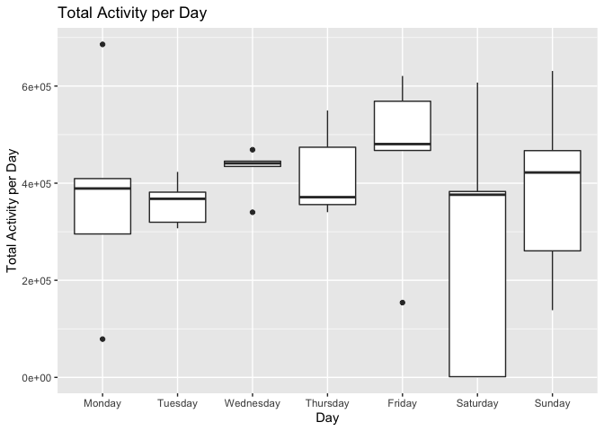
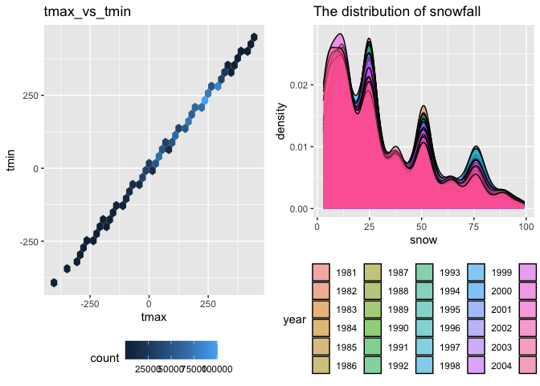
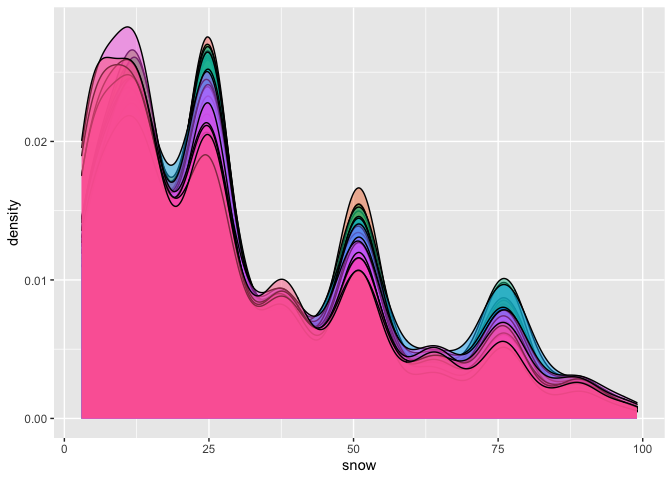

p8105\_hw3\_js5095
================
Jianting Shi
2020-10-10

# Problem 1

``` r
data("instacart")
```

This dataset contains 1384617 rows and 15 columns.  
The 15 variables include order\_id, product\_id, add\_to\_cart\_order,
reordered, user\_id, eval\_set, order\_number, order\_dow,
order\_hour\_of\_day, days\_since\_prior\_order, product\_name,
aisle\_id, department\_id, aisle, department.  
Observations are the level of items in orders by user. There are user /
order variables – user ID, order ID, order day, and order hour. There
are also item variables – name, aisle, department, and some numeric
codes.

## 1.1 How many aisles, and which are most items from?

``` r
aisle_df = 
  instacart %>% 
  count(aisle) %>% 
  arrange(desc(n))
```

There are 134 aisles and the most items are from fresh vegetables.

## 1.2 Make a plot that shows the number of items ordered in each aisle, limiting this to aisles with more than 10000 items ordered.

``` r
aisle_df %>% 
  filter(n > 10000) %>% 
  mutate(
    aisle = factor(aisle),
    aisle = fct_reorder(aisle, n)
  ) %>% 
  ggplot(aes(x = aisle, y = n)) +
  geom_point() + 
  theme(axis.text.x = element_text(angle = 90, vjust = 0.5, hjust = 1))
```

<!-- -->

## 1.3 Make a table showing the three most popular items in each of the aisles “baking ingredients”, “dog food care”, and “packaged vegetables fruits”. Include the number of times each item is ordered in your table.

``` r
aisle_df_2 = 
  instacart %>% 
  filter(aisle %in% c("baking ingredients", "dog food care", "packaged vegetables fruits")) %>%
  group_by(aisle) %>% 
  count(product_name) %>% 
  mutate(rank = min_rank(desc(n))) %>% 
  filter(rank < 4) %>% 
  arrange(aisle, rank) %>% 
  knitr::kable()
```

## 1.4 Make a table showing the mean hour of the day at which Pink Lady Apples and Coffee Ice Cream are ordered on each day of the week; format this table for human readers (i.e. produce a 2 x 7 table).

``` r
aisle_df_3 =
  instacart %>% 
  filter(product_name %in% c("Pink Lady Apples", "Coffee Ice Cream")) %>%
  group_by(product_name, order_dow) %>% 
  summarize(mean_hour = mean(order_hour_of_day)) %>%
  pivot_wider(
    names_from = order_dow,
    values_from = mean_hour
  )
```

    ## `summarise()` regrouping output by 'product_name' (override with `.groups` argument)

# Problem 2

## 2.1 Read the accelerometer dataset

``` r
accel_df = 
  read_csv("./Data/accel_data.csv") %>%
  janitor::clean_names() %>% 
  pivot_longer(starts_with("activity"), names_to = "minute", values_to = "activity_count") %>% 
  mutate(day_type = 
           case_when(day %in% c("Monday", "Tuesday", "Wednesday", "Thursday", "Friday") ~ "weekday",
                     day %in% c("Saturday", "Sunday") ~ "weekend"),
)
```

    ## Parsed with column specification:
    ## cols(
    ##   .default = col_double(),
    ##   day = col_character()
    ## )

    ## See spec(...) for full column specifications.

``` r
accel_df =
  accel_df %<>% 
  separate(col = minute, sep = "_", into = c("to_drop", "minute")) %>% 
  select(-to_drop) %>% 
  mutate(minute = as.numeric(minute)) %>% 
  mutate(day_order = case_when(grepl("Monday", day) ~ 1,
                               grepl("Tuesday", day) ~ 2,
                               grepl("Wednesday", day) ~ 3,
                               grepl("Thursday", day) ~ 4,
                               grepl("Friday", day) ~ 5,
                               grepl("Saturday", day) ~ 6,
                               grepl("Sunday", day) ~ 7))
```

\*\*\* The resulting dataset has variables including week, day\_id, day,
minute, activity\_count, day\_type, day\_order, which describe the
weekday It contains 50400 rows and 7 columns.  

## 2.2 Using your tidied dataset, aggregate accross minutes to create a total activity variable for each day, and create a table showing these totals.

``` r
accel_sum_df = 
  accel_df %>% 
  group_by(week, day) %>% 
  mutate(total_activity = sum(activity_count)) %>%
  select(week, day, day_id, total_activity) %>% 
  distinct() 

knitr::kable(accel_sum_df)
```

| week | day       | day\_id | total\_activity |
| ---: | :-------- | ------: | --------------: |
|    1 | Friday    |       1 |       480542.62 |
|    1 | Monday    |       2 |        78828.07 |
|    1 | Saturday  |       3 |       376254.00 |
|    1 | Sunday    |       4 |       631105.00 |
|    1 | Thursday  |       5 |       355923.64 |
|    1 | Tuesday   |       6 |       307094.24 |
|    1 | Wednesday |       7 |       340115.01 |
|    2 | Friday    |       8 |       568839.00 |
|    2 | Monday    |       9 |       295431.00 |
|    2 | Saturday  |      10 |       607175.00 |
|    2 | Sunday    |      11 |       422018.00 |
|    2 | Thursday  |      12 |       474048.00 |
|    2 | Tuesday   |      13 |       423245.00 |
|    2 | Wednesday |      14 |       440962.00 |
|    3 | Friday    |      15 |       467420.00 |
|    3 | Monday    |      16 |       685910.00 |
|    3 | Saturday  |      17 |       382928.00 |
|    3 | Sunday    |      18 |       467052.00 |
|    3 | Thursday  |      19 |       371230.00 |
|    3 | Tuesday   |      20 |       381507.00 |
|    3 | Wednesday |      21 |       468869.00 |
|    4 | Friday    |      22 |       154049.00 |
|    4 | Monday    |      23 |       409450.00 |
|    4 | Saturday  |      24 |         1440.00 |
|    4 | Sunday    |      25 |       260617.00 |
|    4 | Thursday  |      26 |       340291.00 |
|    4 | Tuesday   |      27 |       319568.00 |
|    4 | Wednesday |      28 |       434460.00 |
|    5 | Friday    |      29 |       620860.00 |
|    5 | Monday    |      30 |       389080.00 |
|    5 | Saturday  |      31 |         1440.00 |
|    5 | Sunday    |      32 |       138421.00 |
|    5 | Thursday  |      33 |       549658.00 |
|    5 | Tuesday   |      34 |       367824.00 |
|    5 | Wednesday |      35 |       445366.00 |

``` r
ggplot(accel_sum_df, aes(x = day, y = total_activity)) + 
  geom_violin(aes(fill = week), alpha = .5) + 
  stat_summary(fun = "median", color = "black")
```

    ## Warning: Removed 7 rows containing missing values (geom_segment).

<!-- -->

\*\*\* It seems his activity of day are more stable on Tuesday to
Thursday, but more fluctuated from Friday to Monday.

## 2.3 Make a single-panel plot that shows the 24-hour activity time courses for each day and use color to indicate day of the week.

``` r
accel_df %>% 
  ggplot(aes(x = minute, y = activity_count, color = day)) + 
  geom_line() +
  labs(
    title = "Daily Accelerometer Data",
    x = "Minute",
    y = "Activity_count"
  ) +
  theme(legend.position = "bottom")
```

<!-- -->

# Problem 3

## 3.0 Read the NY NOAA dataset

``` r
library(p8105.datasets)
data("ny_noaa")
```

This NY-NOAA dataset contains 2595176 rows and 7 columns.  
The 7 variables include id, date, prcp, snow, snwd, tmax, tmin.  
Observations are daily levels of precipitation, snowfall and snow depth,
which are numeric inputs. Maximum temperature and minimum temperature
are also recorded here, which are character inputs. These obervations
are ordered by both date and weather station ID.  

## 3.1 Data cleaning

``` r
ny_noaa_df =
  ny_noaa %>% 
  janitor::clean_names() %>% 
  separate(date, into = c("year", "month", "day"), sep = "-") %>% 
  mutate(
    tmax = as.numeric(tmax),
    tmin = as.numeric(tmin)
  )
    
knitr::kable(
  ny_noaa_df %>% 
  count(snow) %>% 
  arrange(desc(n)))
```

|  snow |       n |
| ----: | ------: |
|     0 | 2008508 |
|    NA |  381221 |
|    25 |   31022 |
|    13 |   23095 |
|    51 |   18274 |
|    76 |   10173 |
|     8 |    9962 |
|     5 |    9748 |
|    38 |    9197 |
|     3 |    8790 |
|   102 |    6552 |
|    10 |    5106 |
|    20 |    4797 |
|    64 |    4506 |
|   127 |    3901 |
|    15 |    3672 |
|    18 |    3226 |
|   152 |    3131 |
|    30 |    2814 |
|    89 |    2535 |
|    33 |    2380 |
|    46 |    2123 |
|    28 |    2118 |
|    23 |    1959 |
|   178 |    1650 |
|    36 |    1630 |
|   114 |    1578 |
|   203 |    1475 |
|    41 |    1467 |
|    43 |    1337 |
|    58 |    1198 |
|    56 |    1179 |
|    53 |    1155 |
|    71 |    1075 |
|   140 |     994 |
|    48 |     918 |
|    61 |     849 |
|    81 |     811 |
|    66 |     790 |
|   254 |     786 |
|   229 |     744 |
|    69 |     726 |
|    97 |     704 |
|    79 |     635 |
|   165 |     614 |
|    84 |     553 |
|   107 |     504 |
|    86 |     476 |
|    74 |     463 |
|   305 |     451 |
|    91 |     428 |
|   191 |     426 |
|   122 |     411 |
|    94 |     404 |
|   109 |     393 |
|   279 |     369 |
|   104 |     349 |
|   132 |     310 |
|   216 |     292 |
|    99 |     276 |
|   117 |     276 |
|   147 |     268 |
|   135 |     253 |
|   119 |     248 |
|   112 |     243 |
|   356 |     235 |
|   330 |     226 |
|   130 |     217 |
|   157 |     209 |
|   241 |     192 |
|   142 |     187 |
|   173 |     187 |
|   155 |     186 |
|   124 |     183 |
|   137 |     173 |
|   145 |     172 |
|   160 |     149 |
|   381 |     139 |
|   163 |     133 |
|   183 |     132 |
|   198 |     130 |
|   267 |     130 |
|   150 |     124 |
|   185 |     117 |
|   406 |     116 |
|   168 |     115 |
|   170 |     104 |
|   457 |     100 |
|   208 |      98 |
|   180 |      93 |
|   292 |      81 |
|   175 |      80 |
|   188 |      77 |
|   196 |      75 |
|   206 |      74 |
|   193 |      70 |
|   318 |      70 |
|   211 |      69 |
|   343 |      63 |
|   432 |      63 |
|   224 |      61 |
|   201 |      60 |
|   213 |      58 |
|   249 |      58 |
|   218 |      55 |
|   508 |      54 |
|   221 |      53 |
|   234 |      52 |
|   236 |      49 |
|   259 |      48 |
|   274 |      45 |
|   483 |      44 |
|   231 |      43 |
|   239 |      39 |
|   246 |      37 |
|   284 |      37 |
|   244 |      36 |
|   226 |      35 |
|   559 |      35 |
|   610 |      35 |
|   257 |      34 |
|   368 |      32 |
|   310 |      29 |
|   262 |      28 |
|   282 |      28 |
|   394 |      27 |
|   264 |      24 |
|   290 |      24 |
|   300 |      24 |
|   272 |      22 |
|   287 |      22 |
|   302 |      22 |
|   312 |      22 |
|   323 |      22 |
|   251 |      21 |
|   277 |      20 |
|   295 |      20 |
|   470 |      20 |
|   584 |      20 |
|   269 |      19 |
|   307 |      17 |
|   338 |      17 |
|   345 |      17 |
|   762 |      17 |
|   533 |      16 |
|   351 |      15 |
|   361 |      15 |
|   366 |      15 |
|   419 |      15 |
|   297 |      14 |
|   363 |      14 |
|   315 |      13 |
|   335 |      13 |
|   340 |      13 |
|   660 |      13 |
|   325 |      12 |
|   353 |      12 |
|   358 |      12 |
|   376 |      12 |
|   414 |      12 |
|   401 |      10 |
|   635 |      10 |
|   711 |      10 |
|   333 |       9 |
|   417 |       9 |
|   737 |       9 |
|   386 |       8 |
|   411 |       8 |
|   427 |       8 |
|   437 |       8 |
|   445 |       8 |
|   521 |       8 |
|   320 |       7 |
|   404 |       7 |
|   434 |       7 |
|   328 |       6 |
|   348 |       6 |
|   373 |       6 |
|   384 |       6 |
|   409 |       6 |
|   467 |       6 |
|   546 |       6 |
|   686 |       6 |
|   378 |       5 |
|   389 |       5 |
|   396 |       5 |
|   422 |       5 |
|   447 |       5 |
|   450 |       5 |
|   452 |       5 |
|   460 |       5 |
|   465 |       5 |
|   475 |       5 |
|   371 |       4 |
|   399 |       4 |
|   455 |       4 |
|   472 |       4 |
|   478 |       4 |
|   488 |       4 |
|   549 |       4 |
|   554 |       4 |
|   597 |       4 |
|   699 |       4 |
|   787 |       4 |
|   914 |       4 |
|   424 |       3 |
|   439 |       3 |
|   462 |       3 |
|   495 |       3 |
|   513 |       3 |
|   518 |       3 |
|   572 |       3 |
|   594 |       3 |
|   632 |       3 |
|   775 |       3 |
|   480 |       2 |
|   490 |       2 |
|   498 |       2 |
|   503 |       2 |
|   505 |       2 |
|   511 |       2 |
|   516 |       2 |
|   523 |       2 |
|   526 |       2 |
|   528 |       2 |
|   551 |       2 |
|   561 |       2 |
|   564 |       2 |
|   592 |       2 |
|   622 |       2 |
|   630 |       2 |
|   643 |       2 |
|   663 |       2 |
|   721 |       2 |
|   813 |       2 |
|   838 |       2 |
|   864 |       2 |
|  \-13 |       1 |
|   391 |       1 |
|   429 |       1 |
|   536 |       1 |
|   544 |       1 |
|   556 |       1 |
|   566 |       1 |
|   569 |       1 |
|   574 |       1 |
|   577 |       1 |
|   579 |       1 |
|   587 |       1 |
|   589 |       1 |
|   607 |       1 |
|   612 |       1 |
|   615 |       1 |
|   620 |       1 |
|   625 |       1 |
|   645 |       1 |
|   648 |       1 |
|   650 |       1 |
|   665 |       1 |
|   693 |       1 |
|   704 |       1 |
|   734 |       1 |
|   754 |       1 |
|   808 |       1 |
|   810 |       1 |
|   843 |       1 |
|   861 |       1 |
|   871 |       1 |
|   892 |       1 |
|   940 |       1 |
|   953 |       1 |
|   965 |       1 |
|   978 |       1 |
|  1041 |       1 |
|  1067 |       1 |
|  1105 |       1 |
|  1143 |       1 |
|  1207 |       1 |
|  6350 |       1 |
|  7122 |       1 |
|  7765 |       1 |
| 10160 |       1 |

For snowfall, the most commonly observed values are 0, since there is no
snowfall for most time of the year.

## 3.2 Make a two-panel plot showing the average max temperature in January and in July in each station across years.

``` r
ny_noaa_df_mean_tmax = 
  ny_noaa_df %>% 
  filter(month == "01" | month == "07") %>% 
  group_by(month, id, year) %>% 
  na.omit() %>% 
  summarise(mean_tmax = mean(tmax * 0.1)) %>% 
  distinct()
```

    ## `summarise()` regrouping output by 'month', 'id' (override with `.groups` argument)

``` r
ny_noaa_df_mean_tmax %>% 
ggplot(aes(y = mean_tmax)) +
  geom_boxplot() +
  facet_grid(.~month) +
  ggtitle("The average max temperature in January and in July in each station across years") +
  theme(axis.title.x = element_blank(),
        axis.text.x = element_blank(),
        axis.ticks.x = element_blank())
```

<!-- -->

Observed from the boxplot, the average max temperature in January, which
is around 0 degree celcius, is much lower than in July, which is around
27 degree celcius.  
That’s because in January it’s winter in NY and in July it’s summer.  
There are outliers in both January and July.

## 3.3 Make a two-panel plot

``` r
tmax_vs_tmin = 
  ny_noaa_df %>% 
  group_by(year, month) %>% 
  na.omit(tmax) %>% 
  na.omit(tmin) %>% 
  mutate(tmax = as.numeric(tmax, na.rm = TRUE)) %>% 
  mutate(tmin = as.numeric(tmax, na.rm = TRUE)) %>% 
  ggplot(aes(x = tmax, y = tmin)) + 
  geom_hex(bins = 15) +
  theme(legend.position = "none")

tmax_vs_tmin
```

<!-- -->

``` r
snowfall_lim = 
  ny_noaa_df %>% 
  filter(snow > 0, snow < 100) %>% 
  ggplot(aes(x = snow, fill = year)) +
  geom_density(alpha = 0.5) +
  theme(legend.position = "none")

snowfall_lim
```

<!-- -->
